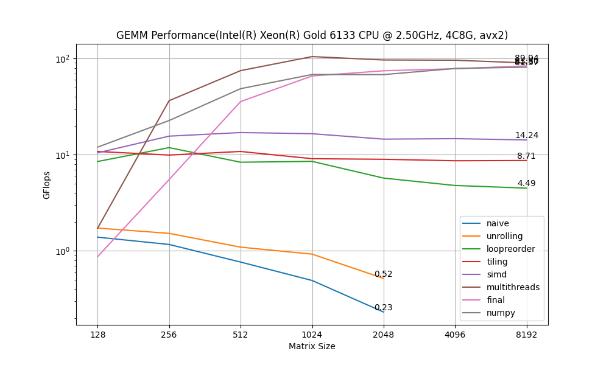
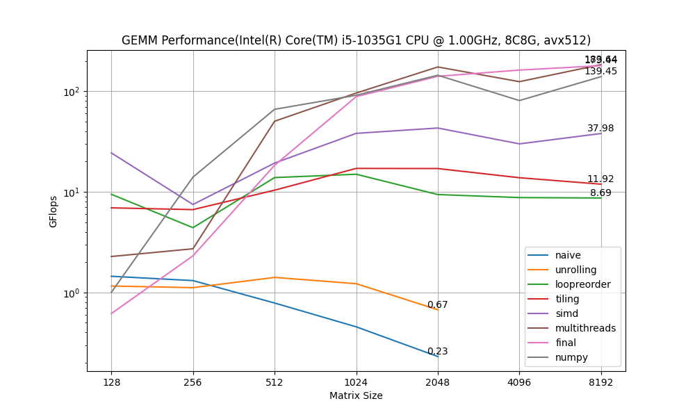

# Optimize GEMM

Several techniques that speedup GEMM(general matrix multiplication), including loop unrolling, loop reorder, tiling, SIMD and multithreads.

Notice that these implementations is correct *if and only if m,n,k(the matrix size) is devisible by 64* except for the *gemm_final* version which is correct for all positive m,n,k.


## Directory Structure
Here is an outline of the main files and directories:
```ccs
.
├── assets
│   ├── gemm_performance_4c_avx2.png
│   ├── gemm_performance_8c_avx512.png
│   └── timing.py
├── benchmark.cpp
├── CMakeLists.txt
├── gemm_numpy.py
├── include
│   ├── argparse
│   │   └── argparse.hpp
│   ├── fmt
│   │   └── xxx.h  // not important for this repo  
│   ├── matrix.hpp
│   └── simd_wrapper.h
├── README.md
└── src
    ├── gemm_final.cpp
    ├── gemm_loopreorder.cpp
    ├── gemm_multithreads.cpp
    ├── gemm_naive.cpp
    ├── gemm_simd.cpp
    ├── gemm_tiling.cpp
    └── gemm_unrolling.cpp

5 directories, 31 files
```

## Build

C++ standard required: C++17
you may need g++-11 or later for gemm_final which use `std::experimental::simd`.


```bash
cmake -S . -B build -DCMAKE_BUILD_TYPE=Release
cmake --build build -j
```
This will produce an executable named `benchmark`.


## Runing:
for example, you can only run `tiling` gemm with Matrix A: 640x12800 and Matrix B: 12800 x 6400:

`./build/benchmark --version tiling -m 640 -k 12800 -n 6400`

if you don't specify version, than it will run all algorithms, the matrix size by default is (640x12800), (12800x640). For more usage, run `./benchmark -h`


## Result:
The following results shows the performance of different versions of GEMM with different matrix size(square matrix). The complex version is more slow when the matrix size is small, as it has more overhead of threading, copying to aligned memory, etc. 



